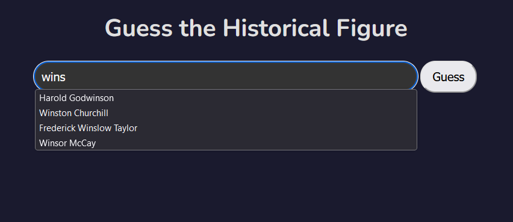
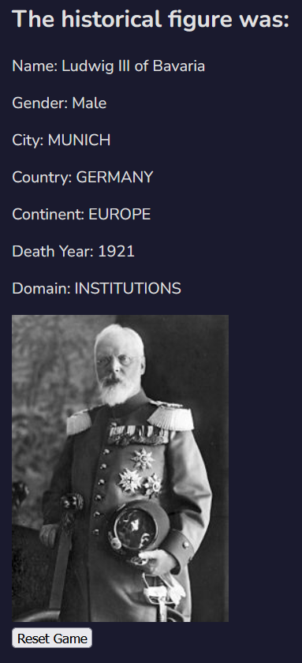

# Deadle —A Historical Figure Guessing Game

Deadle is a web game inspired by the popular word game Wordle, but with a twist - players are trying to guess historical (dead) figures. 

Deadle offers an educational and entertaining experience for history enthusiasts and casual gamers alike.

## Features

- **Interactive Guessing Game:** Players receive clues to guess the historical figure within limited attempts.
- **Educational Fun:** Learn about interesting historical figures as you play.

### Usage
Start the game by entering a random guess for a dead historical figure.
Use the feedback from each guess to make your next guess more accurate.
You have five attempts to guess the correct figure. Can you guess it right?

### Contributing
Contributions to Deadle are welcome! Feel free to fork the repository and submit pull requests.

## Getting Started

Follow these instructions to get Deadle running on your local machine for development and testing purposes.
1. `python -m venv venv
source venv/bin/activate`
    (On windows use `venv\Scripts\activate`)
2. `pip install -r requierments.txt`
3. `python run.py`
4. Navigate to http://127.0.0.1:5000/ in your browser to start playing Deadle!

### Prerequisites

Ensure you have Python 3.10 or later installed on your system. This game uses Flask, so familiarity with Flask and Python web development is helpful.

## Data
There was alot of work to be done on the database (credit in here).
For the start, there were 11,340 different figures in it, around 6500 dead and 4500 alive.
Those figures where from 195 countries and over 5,000 cities.
Some of those cities had latitude and longitude values, and some needed to be manually added.
The data also have for each historic figure one of 88 distinct occupations,
27 industries and 8 different domains of human activity including arts,
sports, science & technology, and more.

The datasets include figures that were born as early as 3500 BCE and those who died as late as 2017.
This rich timeline offers players a chance
to guess among more than 6500 historical figures who have left their mark on the world.
Each guess is an opportunity to learn and connect with the legacies of these remarkable individuals.

