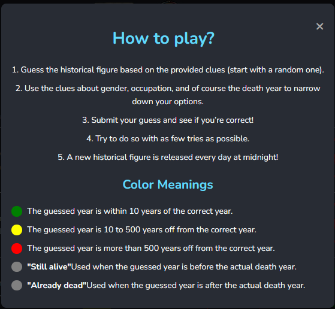
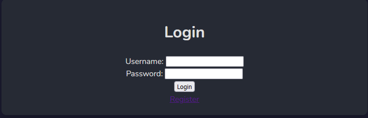
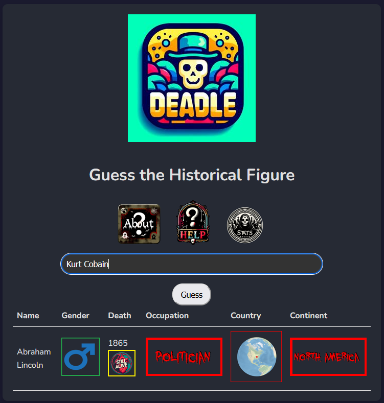
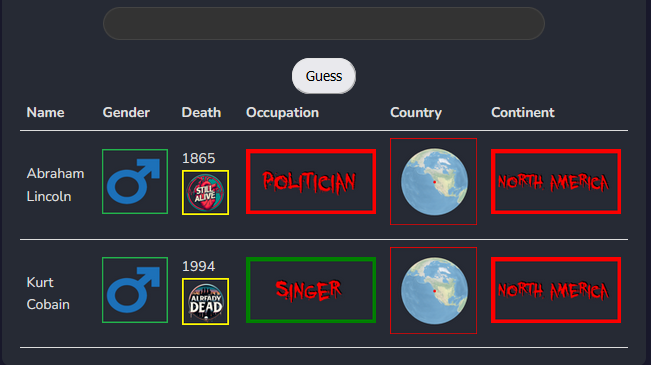
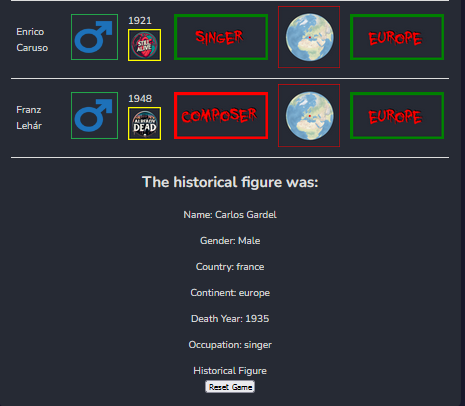
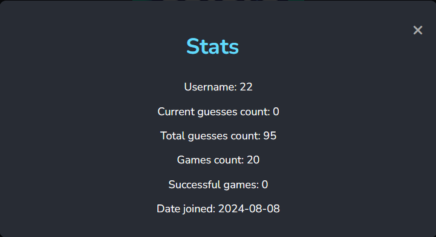

# Deadle — A Historical Figure Guessing Game

Deadle is a web game inspired by the popular game Wordle, with a twist - players are trying to guess historical (dead) figures. 

## Features
- **Educational Fun:** Learn about interesting historical figures as you play.
- **Guessing Game:** Players receive clues to guess the historical figure within limited attempts.
- **The clues:** The clues are feedback for the information of the player's last guess that include:
- *gender*
- *occupation*
- *death year*
- *globe view*

## **How to Play**

1. Login

2. Guess the historical figure based on the provided clues.

2. Use the clues to narrow down your options.

3. Submit your guess and see if you’re correct!

4. Try to do so with as little tries as possible.

5. If you could do it you won! else, there will be a new historical figure to guess tommorw!

### Contributing
Contributions to Deadle are welcome! Feel free to fork the repository and submit pull requests.

## Getting Started

Follow these instructions to get Deadle running on your local machine for development and testing purposes.
1. `python -m venv venv
source venv/bin/activate`
    (On windows use `venv\Scripts\activate`)
2. `pip install -r requierments.txt`
3. `python run.py`
4. Navigate to http://127.0.0.1:5000/ in your browser to start playing Deadle!

### Prerequisites

Ensure you have Python 3.10 or later installed on your system. This game uses Flask, so familiarity with Flask and Python web development is helpful.

## Data
The database had 11,340 different figures in it, around 6500 dead and 4500 alive.
Those figures where from 195 different countries and over 5,000 cities.

Some of those cities had latitude and longitude values, and some needed to be manually added.

The data also provides for each historic figure one of 88 distinct occupations,
27 industries and 8 different domains of human activity including arts,
sports, science & technology, and more.

The datasets include figures that were born as early as 3500 BCE and those who died as late as 2017.

This rich timeline offers players a chance to guess among more than 6500 historical figures who have left their mark on the world. 

## Technologies Used
- **Python**: The main programming language used.
- **JavaScript**: For handling user interactions and actions.
- **Flask**: For building the web application.
- **Pandas**: For the database of historical figures.
- **HTML/CSS**: For the frontend design.
- **PIL** For creating pictures for 
- **matplotlib** and **seaborn** for visualization
- **BeautifulSoup** For scraping information from wikipedia

